# cc-md


[中文](README.zh.md) | **English**

Local-first Obsidian multi-device sync. Zero cost. Zero signup. Zero maintenance.

## Why This Exists

Obsidian vault is just a folder of `.md` files. This means AI tools like Claude Code can **read and write your knowledge base directly**:

`No API` &ensp; `No plugins` &ensp; `No middleware`

```bash
# Claude Code works with your vault natively
Grep "system design" ~/vault/       # search all notes
Read ~/vault/some-note.md           # read content
Edit ~/vault/some-note.md           # modify content
Glob "**/*.md" ~/vault/             # traverse entire knowledge base
```

Compare with cloud-based solutions:

|  | Obsidian vault | Notion |
|--|---------------|--------|
| AI access | Read files directly, zero config | API + OAuth + MCP required |
| Data format | Standard markdown | Proprietary blocks, needs parsing |
| Read/write speed | Local I/O, milliseconds | Network requests + rate limits |
| Version history | Full Git log of every change | None |
| Data ownership | Files on your disk | Stored on someone else's server |

**Local files + standard format = no "integration" needed. It just works.**

cc-md simply keeps this local knowledge base in sync across all your devices.

## Architecture

```mermaid
graph LR
    subgraph icloud ["☁️ iCloud — seconds"]
        direction LR
        iPhone["📱<br/>iPhone"]
        Mac["💻<br/>macOS"]
    end

    subgraph git ["🍀 Git — every 5 min"]
        direction LR
        GitHub["🍀<br/>GitHub"]
    end

    iPhone <--> Mac
    Mac <--> GitHub
    GitHub -.->|optional| Windows["🖥️<br/>Windows"]

    style icloud fill:#eff6ff,stroke:#3b82f6,stroke-width:2px,color:#1e40af
    style git fill:#f0fdf4,stroke:#16a34a,stroke-width:2px,color:#15803d
    style iPhone fill:#3b82f6,color:#fff,stroke:#2563eb,stroke-width:2px
    style Mac fill:#3b82f6,color:#fff,stroke:#2563eb,stroke-width:2px
    style GitHub fill:#16a34a,color:#fff,stroke:#15803d,stroke-width:2px
    style Windows fill:#94a3b8,color:#fff,stroke:#64748b,stroke-width:2px,stroke-dasharray: 5 5
```



- **macOS ↔ iOS**: iCloud auto-sync (seconds)
- **macOS ↔ GitHub**: Git timed sync (every 5 min, only when changes exist)

Windows users can `git clone` the repo and use [obsidian-git](https://github.com/denolehov/obsidian-git) for sync.

## Quick Start

**Prerequisite**: Obsidian with an iCloud vault on your Mac.

```bash
bash <(curl -sL https://raw.githubusercontent.com/yuukiLike/cc-md/main/install-remote.sh)
```

The installer will find your vault, set up Git, connect to GitHub, and start syncing.

- **1 vault + `gh` CLI + SSH key** → zero prompts, fully automatic
- **1 vault + SSH key, no `gh`** → 1 prompt (paste repo URL)
- **No SSH key** → tells you exactly how to fix it

**iPhone**: Install Obsidian → open the same iCloud vault. Done.

## Verify

**Mac → iPhone**: Create a note on Mac, it should appear on iPhone within 30 seconds.

**iPhone → Mac**: Write something on iPhone, it should appear on Mac within 30 seconds.

**Git sync**: Wait 5 minutes or run `md sync`, then check GitHub for new commits. Run `md status` to see current state.

## How Sync Works

**iCloud** (macOS ↔ iOS): Handled by Apple automatically. Vault lives at `~/Library/Mobile Documents/iCloud~md~obsidian/Documents/<vault>/`. Syncs in seconds.

**Git** (macOS ↔ GitHub): A launchd job runs sync.sh every 5 minutes:

```mermaid
flowchart TD
    subgraph trigger ["⏰ Every 5 min — launchd"]
        check{"📂<br/>Any changes?"}
    end

    subgraph sync ["🍀 Sync pipeline"]
        stage["➕ git add -A"]
        commit["💾 git commit"]
        pull["⬇️ git pull --rebase"]
        push["⬆️ git push"]
    end

    check -->|No| skip(["💤 Sleep — nothing to do"])
    check -->|Yes| stage
    stage --> commit --> pull --> push
    push --> done(["✅ Synced to GitHub"])
    pull -->|conflict| err(["⚠️ Needs manual fix<br/>md doctor to diagnose"])

    style trigger fill:#eff6ff,stroke:#3b82f6,stroke-width:2px,color:#1e40af
    style sync fill:#f0fdf4,stroke:#16a34a,stroke-width:2px,color:#15803d
    style check fill:#3b82f6,color:#fff,stroke:#2563eb,stroke-width:2px
    style stage fill:#16a34a,color:#fff,stroke:#15803d,stroke-width:2px
    style commit fill:#16a34a,color:#fff,stroke:#15803d,stroke-width:2px
    style pull fill:#16a34a,color:#fff,stroke:#15803d,stroke-width:2px
    style push fill:#16a34a,color:#fff,stroke:#15803d,stroke-width:2px
    style skip fill:#94a3b8,color:#fff,stroke:#64748b,stroke-width:2px
    style done fill:#15803d,color:#fff,stroke:#166534,stroke-width:2px
    style err fill:#ef4444,color:#fff,stroke:#dc2626,stroke-width:2px
```



**Why 5 minutes**: 30s is too noisy, 1h is too slow, 5 min is just right for finishing a thought. Adjustable via `StartInterval` in `~/Library/LaunchAgents/com.cc-md.sync.plist`.

## Why Not Other Solutions

| Alternative | Why not |
|-------------|---------|
| iCloud everywhere | Poor Windows sync, no version history |
| Obsidian Sync | ~$4/mo, ~$480 over 10 years |
| Git everywhere | No good free Git client on iOS |
| Notion | Proprietary format, data not local, AI needs API |
| Self-hosted | High maintenance cost, dies when you stop |

This approach: iCloud for Apple ecosystem sync, Git for cross-platform + version history. Zero cost.

## Risks & Mitigations

| Risk | Mitigation |
|------|------------|
| iCloud corrupts .git | Low probability; remote repo is full backup |
| macOS off, iOS edits can't push | Auto-syncs when Mac wakes up |
| Git conflicts | `pull --rebase` + plain text is easy to resolve |
| GitHub down | Local + iCloud dual backup |

## Common Commands

```bash
md                      # check sync status (same as md status)
md doctor               # health check, diagnose issues
md sync                 # manual sync now
md log                  # view last 20 log entries
md log 50               # view last 50 log entries
md setup                # smart setup (idempotent, skips completed steps)
```

**Vault renamed?** No action needed. sync.sh auto-discovers the vault by scanning for `.git` in the iCloud Obsidian directory.

**Sync issues?** Run `md doctor` to diagnose.

## Uninstall

```bash
bash scripts/uninstall.sh
```

Your notes are not affected. iCloud sync continues. Only auto-push to GitHub stops.

## Contributing

```bash
bash tests/run.sh
```

Pure bash test suite, zero dependencies. Run it after any change to `scripts/`. All tests must pass before submitting a PR.

## Project Structure

```
cc-md/
├── scripts/
│   ├── cc-md               # CLI client (md status/doctor/sync/log/setup)
│   ├── setup.sh            # smart installer (idempotent, 8 phases)
│   ├── install.sh          # backward-compat wrapper → setup.sh
│   ├── uninstall.sh        # uninstall
│   └── sync.sh             # auto-sync (every 5 min)
├── tests/
│   ├── run.sh              # test runner
│   ├── test_cc-md.sh       # CLI tests
│   ├── test_sync.sh        # sync logic tests
│   └── test_setup.sh       # setup logic tests
├── install-remote.sh       # curl one-liner entry point
├── com.cc-md.sync.plist    # launchd job template
├── LICENSE
├── README.md               # English
└── README.zh.md            # 中文
```
