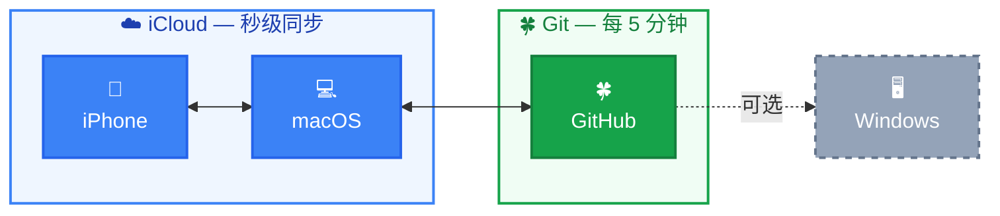
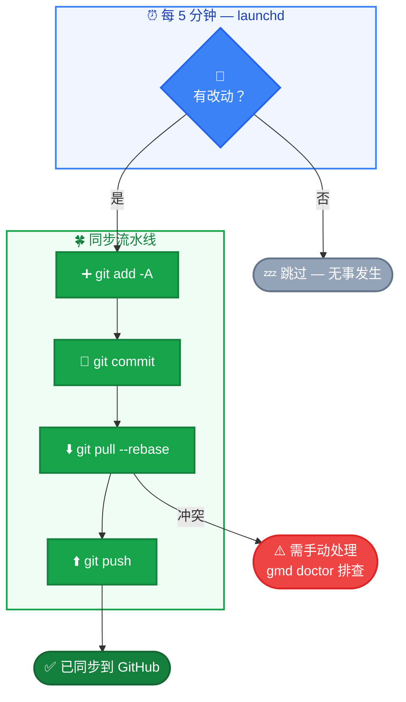

# zeromd


**中文** | [English](README.md)

本地优先的 Obsidian 多端同步方案。零成本，零注册，零维护。

## 为什么做这个

最 AI 友好的知识库不是某个带 API 的 SaaS 产品，而是你硬盘上的一堆 markdown 文件。

而 `.md` 的进化还没结束——Mermaid 已经让纯文本变成了可交互的图表，这只是开始。

Obsidian 把所有笔记存成 `.md` 文件。AI 工具（如 Claude Code）可以**直接读写你的知识库**：

`零 API` &ensp; `零插件` &ensp; `零中间层`

```bash
# Claude Code 天然能做这些事
Grep "系统设计" ~/vault/         # 搜索所有笔记
Read ~/vault/某篇笔记.md        # 读取内容
Edit ~/vault/某篇笔记.md        # 修改、补充
Glob "**/*.md" ~/vault/         # 遍历整个知识库
```

对比 Notion 等云端方案：

|  | Obsidian vault | Notion |
|--|---------------|--------|
| AI 接入 | 直接读文件，零配置 | 需要 API + OAuth + MCP |
| 数据格式 | 标准 markdown | 私有 block 结构，需解析 |
| 读写速度 | 本地 I/O，毫秒级 | 网络请求 + rate limit |
| 版本历史 | Git log 完整记录每次变更 | 无 |
| 数据所有权 | 文件在你的硬盘上 | 存在别人的服务器上 |

**本地文件 + 标准格式 = 不需要"接入"，天然就在一起。**

zeromd 做的事很简单：让这个本地知识库在你的所有设备间保持同步。

## 架构



- **macOS ↔ iOS**：iCloud 自动同步（秒级）
- **macOS ↔ GitHub**：Git 定时同步（每 5 分钟，有改动才提交）

Windows 用户可 `git clone` 仓库后配合 [obsidian-git](https://github.com/denolehov/obsidian-git) 插件同步。

## 快速上手

**前提**：Mac 上已安装 Obsidian，并创建了 iCloud vault。

```bash
bash <(curl -sL https://raw.githubusercontent.com/yuukiLike/zeromd/main/install-remote.sh)
```

安装器会自动发现 vault、初始化 Git、连接 GitHub、启动同步。

- **1 个 vault + `gh` CLI + SSH key** → 零提示，全自动
- **1 个 vault + SSH key，无 `gh`** → 1 个提示（贴 repo URL）
- **无 SSH key** → 明确告诉怎么修，re-run 即恢复

**iPhone**：装 Obsidian → 打开同一个 iCloud vault，搞定。

## 为什么命令叫 `gmd` 而不是 `md`

部分 shell 环境会占用 `md`（例如 oh-my-zsh 默认 `alias md='mkdir -p'`）。为避免冲突，主命令改为 `gmd`（git + md）。如果你的 shell 里 `md` 没被占用，它同样可用——两者指向同一个脚本。

## 验证

**Mac → iPhone**：Mac 上新建笔记，30 秒后 iPhone 应该能看到。

**iPhone → Mac**：iPhone 上写几个字，30 秒后 Mac 应该能看到。

**Git 同步**：等 5 分钟或运行 `gmd sync`，GitHub 上应该能看到新 commit。运行 `gmd status` 查看当前状态。

## 同步原理

**iCloud**（macOS ↔ iOS）：苹果系统自动处理，vault 存在 `~/Library/Mobile Documents/iCloud~md~obsidian/Documents/<vault名>/`，秒级同步。

**Git**（macOS ↔ GitHub）：launchd 定时任务每 5 分钟执行 sync.sh：



**为什么 5 分钟**：30 秒太碎，1 小时太慢，5 分钟刚好写完一段想法。可改 `~/Library/LaunchAgents/com.zeromd.sync.plist` 中的 `StartInterval`。

## 方案选型

| 替代方案 | 不选的原因 |
|----------|-----------|
| iCloud 全平台 | Windows 同步差，无版本历史 |
| Obsidian Sync | ~$4/月，10 年 ≈ $480 |
| 纯 Git 全平台 | iOS 无好用的免费 Git 方案 |
| Notion | 私有格式，数据不在本地，AI 接入需要 API |
| 自建服务 | 运维成本高，停维即断 |

本方案：iCloud 管 Apple 生态同步，Git 管跨平台 + 版本历史。成本为零。

## 风险与缓解

| 风险 | 缓解 |
|------|------|
| iCloud 同步 .git 导致损坏 | 概率低；远程仓库是完整备份 |
| macOS 关机时 iOS 编辑无法推到 Git | 开机后自动补推 |
| Git 冲突 | `pull --rebase` + 纯文本易解决 |
| GitHub 中断 | 本地 + iCloud 双备份 |

## 常用命令

```bash
gmd                      # 查看同步状态（等同于 gmd status）
gmd doctor               # 健康检查，逐项诊断
gmd sync                 # 立即手动同步
gmd log                  # 查看最近 20 条同步日志
gmd log 50               # 查看最近 50 条
gmd setup                # 智能安装（幂等，已完成的步骤自动跳过）
# md 也能用，向后兼容
```

**改了 vault 名字？** 不需要任何操作。sync.sh 会自动扫描 iCloud 目录，找到有 `.git` 的 vault。

**同步出问题？** 运行 `gmd doctor` 逐项排查。

## 卸载

```bash
bash scripts/uninstall.sh
```

笔记不受影响，iCloud 同步照常，只是不再自动推 GitHub。

## 参与贡献

```bash
bash tests/run.sh
```

纯 bash 测试套件，零依赖。修改 `scripts/` 下的文件后务必运行测试，PR 前确保全部通过。

## 项目结构

```
zeromd/
├── scripts/
│   ├── zeromd               # CLI 客户端（md status/doctor/sync/log/setup）
│   ├── setup.sh            # 智能安装器（幂等，8 个阶段）
│   ├── install.sh          # 向后兼容包装 → setup.sh
│   ├── uninstall.sh        # 卸载
│   └── sync.sh             # 自动同步（每 5 分钟）
├── tests/
│   ├── run.sh              # 测试运行器
│   ├── test_zeromd.sh       # CLI 测试
│   ├── test_sync.sh        # 同步逻辑测试
│   └── test_setup.sh       # 安装逻辑测试
├── install-remote.sh       # curl 一键安装入口
├── com.zeromd.sync.plist    # launchd 任务模板
├── LICENSE
├── README.md               # English
└── README.zh.md            # 中文
```
